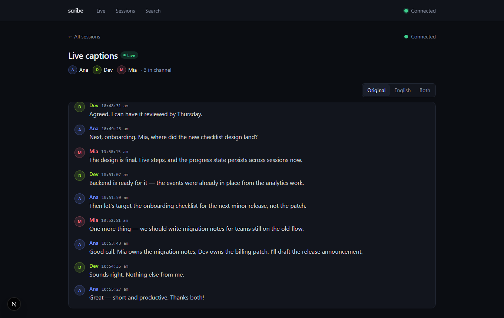
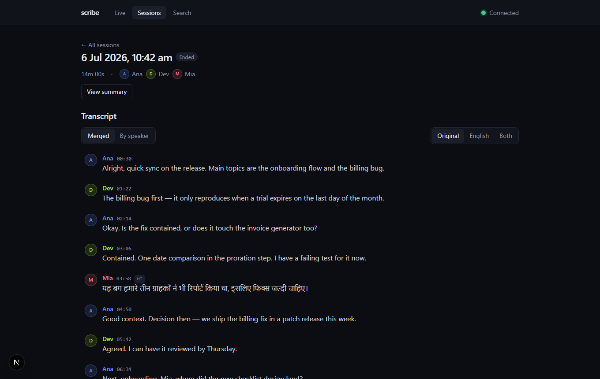
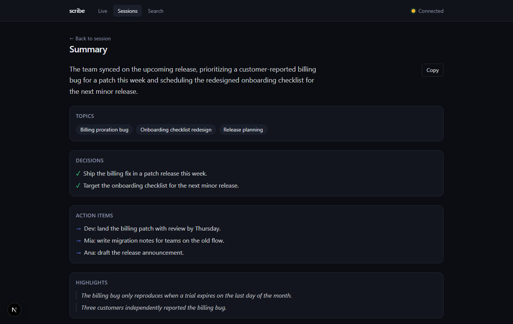
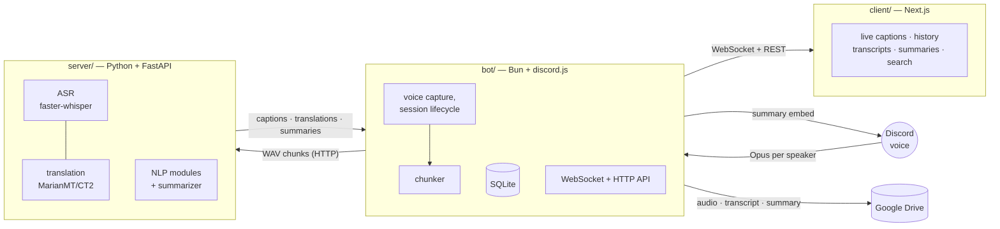

# scribe

**A self-hosted meeting-intelligence assistant for Discord.** scribe automatically joins designated voice channels, records every participant on their own track, and turns live conversation into speaker-attributed captions on a web dashboard. When the call ends it generates a structured summary, posts it to Discord, and archives the audio and transcript to Google Drive.

Everything that touches language — speech-to-text, analysis, translation, and summarization — runs on a **self-hosted NLP pipeline with no paid cloud AI dependencies**. There is no external LLM in the loop; summaries are produced by scribe's own natural-language-generation engine.

<p align="center">
  
</p>

## What it does

- **Auto-records the channels you choose.** Admins mark which voice channels scribe should watch. The moment someone joins a watched channel, scribe joins and starts recording — no manual command needed.
- **Per-speaker capture.** Each participant is recorded as a separate audio stream, so every word is correctly attributed to who said it.
- **Live captions on the web.** As people talk, captions stream to a web dashboard in real time, grouped and labelled per speaker.
- **Translation.** Non-English speech is transcribed in its original language and translated, so everyone's contribution is readable in one language.
- **Custom summaries.** When everyone leaves, scribe builds a structured summary — key topics, decisions, action items, and highlights — using its own NLP pipeline, and posts it to the Discord channel and the dashboard.
- **Searchable history.** Past meetings, full transcripts, and summaries are browsable and searchable (both keyword and meaning-based search).
- **Archived to Drive.** Raw audio, transcripts, and summaries are uploaded to Google Drive automatically, with links surfaced in Discord and on the web.

| Transcript with translation toggle | Generated summary |
|---|---|
|  |  |

## Architecture

scribe is a monorepo of three cooperating services.



### Data flow

1. A user joins a watched voice channel → the **bot** auto-joins and begins per-speaker recording, opening a session.
2. The bot slices each speaker's audio into short chunks and sends them to the **server**, which transcribes (and, where needed, translates) them.
3. Each result is stored (SQLite) and broadcast over a **WebSocket** to the **client**, where it appears as a live caption attributed to the speaker.
4. When the last participant leaves, the bot assembles the full transcript and asks the server to summarize it.
5. The summary is posted to the Discord channel and the dashboard, and the audio, transcript, and summary are archived to **Google Drive**.

### Components

| Folder | Service | Stack | Responsibility |
|--------|---------|-------|----------------|
| [`bot/`](bot/) | Discord bot | Bun, TypeScript, discord.js, @discordjs/voice | Auto-join, per-speaker voice capture, session lifecycle, SQLite store, WebSocket server, Discord delivery, Drive uploads |
| [`server/`](server/) | NLP service | Python, FastAPI, faster-whisper, MarianMT/CTranslate2, NLTK, spaCy, gensim, scikit-learn | Speech-to-text, translation, text analysis, and summarization |
| [`client/`](client/) | Web dashboard | Next.js, TypeScript | Live captions, transcript & session history, summaries, search |

### Why self-hosted

Speech and language processing both run locally on CPU (int8) via CTranslate2 — the same runtime powers transcription and translation. There is no per-minute API cost, no third party receives the audio, and the whole stack runs on modest hardware.

## Quick start

**Prerequisites:** [Bun](https://bun.sh) ≥ 1.2 · Python 3.11 · a Discord application with a bot token (create one in the [Discord developer portal](https://discord.com/developers/applications); it needs the *Server Members* privileged intent off — just default intents — and permission to view/connect to your voice channels when you invite it).

### 1. Install workspaces (bot + client + shared)

```bash
bun install
```

### 2. NLP service

```bash
cd server
python -m venv .venv && .venv/Scripts/activate   # source .venv/bin/activate on macOS/Linux
pip install -r requirements.txt
python scripts/download_models.py                # NLTK data, spaCy model, translation models (one-time)
uvicorn app.main:app --port 8000
```

The one-time translation-model conversion needs PyTorch (`pip install torch`, CPU build is fine); runtime inference does not. Whisper weights download automatically on first transcription.

### 3. Bot

```bash
cp bot/.env.example bot/.env    # fill in DISCORD_TOKEN (+ DISCORD_CLIENT_ID to register slash commands)
bun run dev:bot
```

Then, in your Discord server: `/scribe watch #voice-channel` and `/scribe set-summary-channel #text-channel`.

### 4. Web dashboard

```bash
bun run dev:client               # http://localhost:3000
```

The defaults all line up (NLP on :8000, WS on :8080, HTTP API on :8081) — no extra config needed for local use.

### Optional: Google Drive archival

Set the `GOOGLE_DRIVE_*` variables in `bot/.env` and run `bun run auth:google` once — see [bot/README.md](bot/README.md#google-drive-storage-srcdrive-srcstorage) for the 4-step walkthrough. Without credentials, everything else works; sessions just aren't uploaded.

### Try it without a live call

```bash
cd bot && bun run seed:demo
```

seeds a finished demo session (transcript, translated turn, summary) that the web app serves immediately. The full walkthrough and test checklist live in [docs/demo.md](docs/demo.md).

## NLP capabilities → product features

scribe's language features are built from a set of focused NLP capabilities. Each is a real, self-contained module in `server/`, each powers a concrete product feature, and each has a standalone runnable demo script — documented, with captured outputs, in **[docs/nlp/](docs/nlp/README.md)**.

| NLP capability | What it powers in scribe |
|----------------|--------------------------|
| Tokenization & sentence segmentation | Splitting transcripts into clean units for every downstream step |
| Text normalization (stemming & lemmatization) | Robust keyword matching and search |
| Frequency analysis, stop-word filtering & POS tagging | Keyword and topic extraction |
| Syntactic parsing | Action-item and decision detection |
| N-gram language modeling | Phrase modeling and prediction |
| Word-sense disambiguation | In-context glossary and definitions |
| Template-based natural language generation | Meeting summaries (no external LLM) |
| Machine translation | Multilingual transcripts and captions |
| Information retrieval (TF-IDF / vector space) | Transcript search and ranking |
| Word embeddings | Semantic ("meaning-based") search and topic clustering |

## Repository structure

```
scribe/
├── bot/        # Discord bot — voice capture, sessions, WebSocket, SQLite, Drive
├── server/     # NLP service — speech-to-text, translation, analysis, summarization
├── client/     # Web dashboard — live captions, transcripts, summaries, search
├── shared/     # TypeScript types shared by bot and client
└── docs/       # Demo guide, NLP module reference, screenshots
```

Each service has its own README with deeper documentation:
[bot/README.md](bot/README.md) · [server/README.md](server/README.md) · [client/README.md](client/README.md) · [docs/demo.md](docs/demo.md) · [docs/nlp/README.md](docs/nlp/README.md)

## License

MIT
